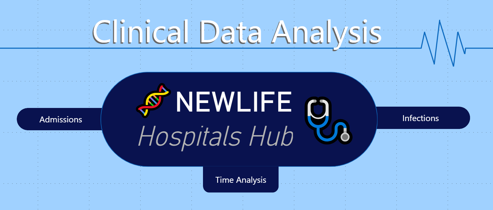
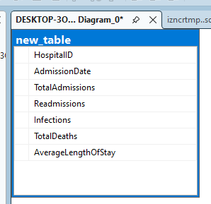
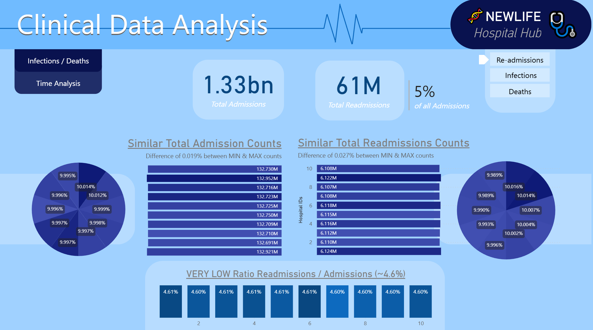
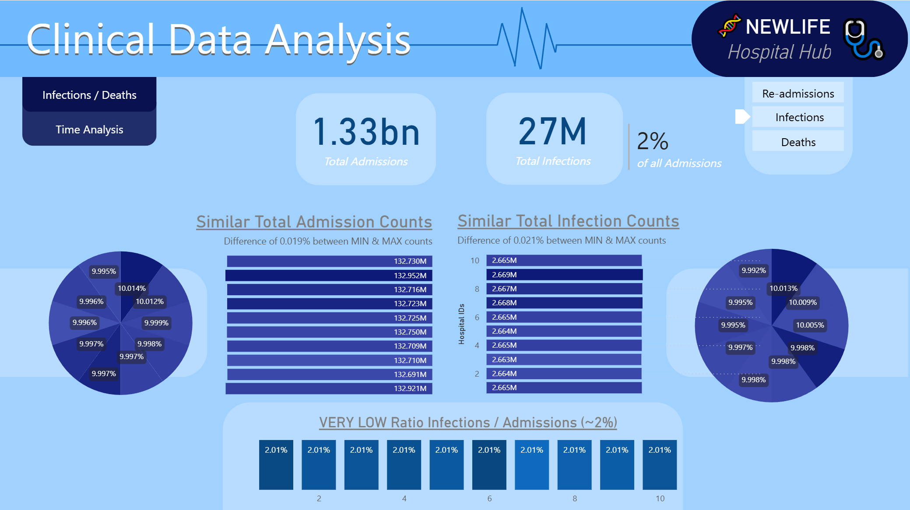
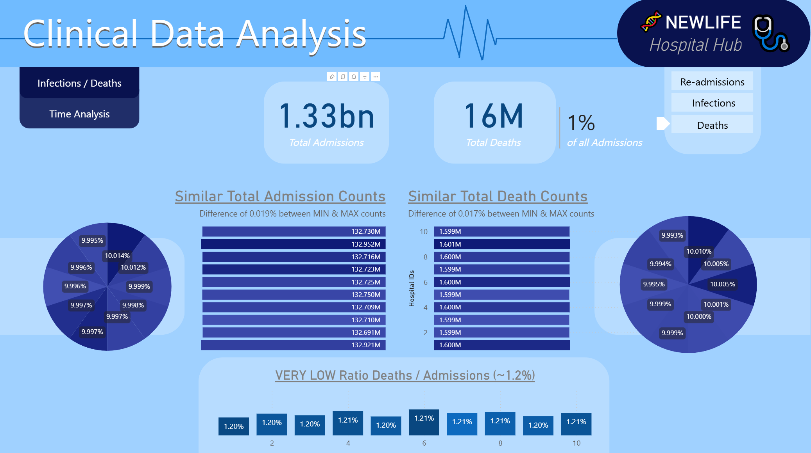
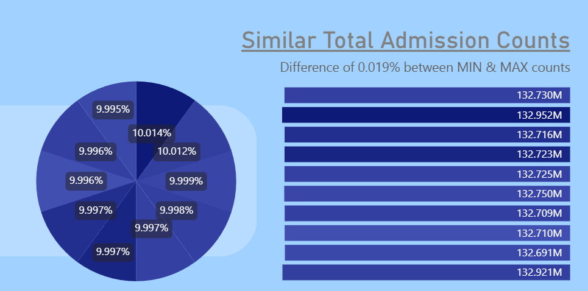
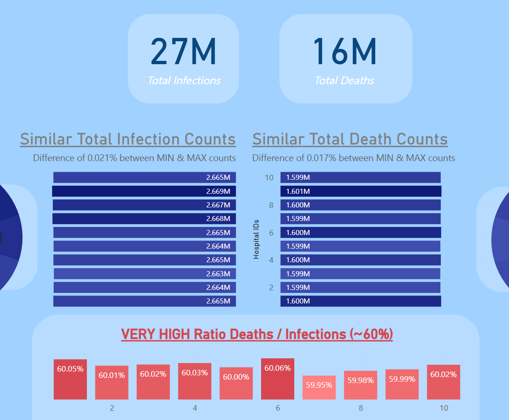
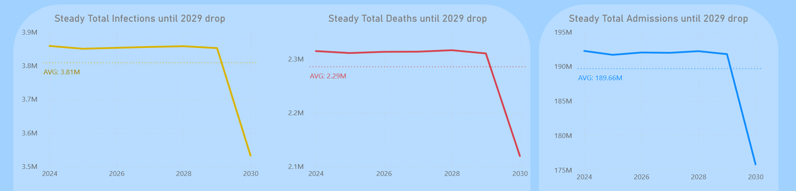

# 🏥 NewLife Hospital Hub  
### 🌐 Clinical Data Analysis (2024–2030)  
*Power BI • SQL • End-to-End BI*

 <!-- Replace with final banner path -->

---

## 📌 Table of Contents
- [🏥 NewLife Hospital Hub](#-newlife-hospital-hub)
    - [🌐 Clinical Data Analysis (2024–2030)](#-clinical-data-analysis-20242030)
  - [📌 Table of Contents](#-table-of-contents)
  - [📊 Project Background](#-project-background)
  - [📃 Workflow](#-workflow)
  - [🧱 Data Structure \& ERD](#-data-structure--erd)
  - [📈 Executive Summary](#-executive-summary)
    - [Top 3 insights for leadership:](#top-3-insights-for-leadership)
  - [🔍 Insights Deep Dive](#-insights-deep-dive)
    - [🏥 Category 1 — Network-Wide Admission Performance](#-category-1--network-wide-admission-performance)
    - [🦠 Category 2 — Infection Control \& Patient Safety](#-category-2--infection-control--patient-safety)
    - [☠️ Category 3 — Mortality Risk \& Severity Management](#️-category-3--mortality-risk--severity-management)
    - [🚀 Category 4 — Strategies Outcome \& Future Impact](#-category-4--strategies-outcome--future-impact)
  - [🎯 Recommendations](#-recommendations)
  - [⚠️ Assumptions \& Caveats](#️-assumptions--caveats)
  - [📚 Learnings](#-learnings)
  - [Next Steps](#next-steps)
  - [📎 Resources \& File Structure](#-resources--file-structure)

---

## 📊 Project Background
NewLife Hospital Hub is one of the largest multi-hospital healthcare networks, operating across **10 facilities** and delivering more than **1.33 billion patient visits** over the analysis period (2024–2030).

As the BI Analyst on this project, the objectives were:
- Evaluating performance consistency across the hospitals network  
- Measuring clinical risk exposure (readmissions, infections, mortality)  
- Measuring the impact of long-term improvement strategies leading into 2030  
- Supporting leadership with insights that guide innovation, prevention, and hospital capacity planning  

Core KPIs analyzed:
- 🏥 Admissions  
- 🔁 Readmissions  
- 🦠 Infections  
- ☠️ Deaths  

This analysis was performed with:  
**SQL** → Built a fully synthetic, HIPAA-safe clinical dataset of 20M records using SQL-based data generation loops (**MS SQL Server**).  
**Power BI** → interactive report with branding and key visualizations - link to the report or to the report here project folder [here](./Power%20BI%20Project). 

---

## 📃 Workflow
Firstly, SQL code was used directly at the data source - MS SQL Server - to generate the 20M records clinical dataset  - find the SQL code [here](./SQL/SQL_Code_For_SyntheticData.sql).  

Secondly, more SQL code was used to do data profiling over the dataset as it is more time-efficient do so at the source  - find the SQL code [here](./SQL/SQL_for_Profiling_Data.sql).
In that same SQL code, an update of the dataset was simulated. A common hurdle was encountered and fixed: date years mismatch. The minimum and maximum year values were not matching, the SQL code prevented this. 

Then only relevant columns were imported into Power BI via the SQL import feature and processed and analysed for report building.  
Following best practices, a date table was created using DAX, ensuring proper date hierarchy from Year down to week number and day of the week.  
The simplicity of the dataset did not call for data modeling.  
Usually the report is then distributed from within members and stakeholders of the organization, with set access over specific lines or columns of data. Here it was just publicly made available without any secured access needed. 

---

## 🧱 Data Structure & ERD

The data model consists of **4 clinical outcome tables**:

| Table | Description | Rows |
|---|---|---:|
| `Admissions` | All patient intake per hospital & year | 1.33B |
| `Readmissions` | Repeat visits within a defined post-care window | 61M |
| `Infections` | Clinical infection incidents | 27M |
| `Deaths` | In-hospital mortality | 16M |

📌 ERD:

  

The column 'AverageLengthOfStay' was excluded during import within Power BI as it is not needed.

---

## 📈 Executive Summary

> **The NewLife Hospitals Hub delivers exceptionally consistent and safe care across the network — with major clinical improvements in 2030 explaining a sharp drop in the same year.**

### Top 3 insights for leadership:
1️⃣ **Performance is balanced across all 10 hospitals**  
Variance across outcomes is **<0.03%**, showing a unified system.

2️⃣ **Clinical care is high-value and safe**  
| Metric | Result |
|---|---:|
| Readmissions / Admissions | **5%** |
| Infections / Admissions | **2%** |
| Deaths / Admissions | **1%** |

3️⃣ **A transformative improvement occurs post-2029**  
→ Sharp drop in admissions, infections & deaths  
→ Effectively lowering network burden

📊 Dashboard Screenshot:  

---

## 🔍 Insights Deep Dive

---

### 🏥 Category 1 — Network-Wide Admission Performance
- Total: **1.33bn**
- Year-over-year stable until **2029**
- **Major decline in 2030** → strategic prevention success
- Variance between hospitals: **0.019%**

📌 Interpretation:  
> Hub is distributing patient load efficiently → no overload risk

---

### 🦠 Category 2 — Infection Control & Patient Safety
- Total infections: **27M** → **2%** of admissions
- Variance across hospitals: **0.021%**
- Significant drop starting **2030**

📌 Interpretation:
> Infection prevention protocols are strong, standardized & improving

---

### ☠️ Category 3 — Mortality Risk & Severity Management
- Total deaths: **16M** → **1%** of admissions
- **~60% of infections result in death**  
→ Indicates infections represent *high-severity cases*

📌 Interpretation:
> Network treats highly critical patients while maintaining stable survival rates

---

### 🚀 Category 4 — Strategies Outcome & Future Impact
| Phase | Trend | Impact |
|---|---|---|
| 2024–2029 | Stable patterns | Predictable resource planning |
| 2030 | Sharp KPI decline | Reduced admissions burden & cost |

📌 Interpretation:
> Prevention & digital health strategies significantly reduce hospital dependency

---

## 🎯 Recommendations

| Area | Action |
|---|---|
| Prevention successes forecasted | Scale preventive care initiatives sooner to accelerate benefits |
| Severe infection case mortality | Deploy AI-based risk detection & rapid AI clinical alert systems |
| Readmissions at 5% | Strengthen post-discharge digital care & telehealth monitoring |
| Uniform performance | Maintain standardized training & protocols across the network |
| Future decline in hospital load | Gradual workforce shifts to outpatient & tele-care. Adjust staffing models gradually to avoid over-capacity |

---

## ⚠️ Assumptions & Caveats
- High mortality/infection ratio is due to **case severity**, not poor care  
- Drop in hospital dependency assumes **prevention and digital-care adoption** were initiated and are active - present time is assumed to be sometime after year 2030 (it is not a forecast)
- Synthetic dataset may **not reflect reality** 
- Hospital identifiers anonymized for privacy and **HIPAA compliance** 

---
## 📚 Learnings
The SQL syntax in MS SQL Server is slightly different, however the logic used for loops in the SQL code is very similar to the one seen in Python loops. Using this specific syntax felt familiar. 

My healthcare domain knowledge was expanded with this project. While the synthetic dataset I created provided enough data to conduct an analysis, the dataset still feels as if it is lacking depth. Data variables like age, zip code, gender, diagnostic, severity of diagnosis, department of admission, etc, enable deeper analysis and insights. 

---
## Next Steps
This work could evolve with the following additions, which can all be added synthetically at the SQL source database: 

**Benchmarking :**

- Compare each hospital against:
- Hub average
- National benchmark standards
- Best-in-class hospital inside network

➡ Introduces competitive context.

**Cost & Finance Layer for Avoidable Cost Savings :**  
Add synthetic financial performance tables:

- Cost per Admission
- Cost per Readmission (roughly ×2)
- ICU daily cost multipliers
- Bed turnover revenue effects

With those we can calculate Avoidable Cost Savings from admissions, readmissions, infections, ICU days, etc., by extracting a baseline volume and/or rate and a capturing data on new volume after improvement. 

**Demographics, Case & Clinical Severity Data:**  
Data on the followings will deppen analysis on Mortality/Infection, patient segmentation, sharper KPIs, risk stratification analysis: 

- age groups, gender, zip, insurance type
- comorbidity index, admission type, ICD-10 group, ICU/Regular Ward

---

## 📎 Resources & File Structure
- Power BI: following best practice, the report source files are available as a packaged project file [here](/Power%20BI%20Project/)
